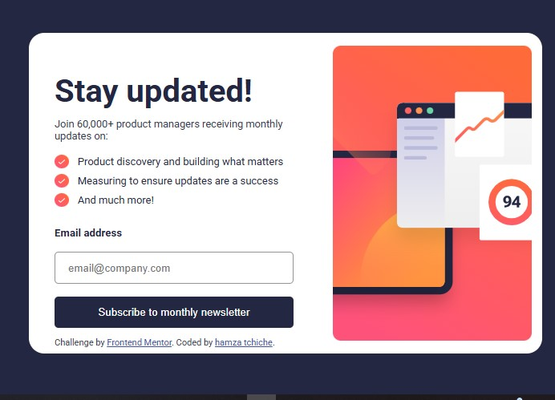
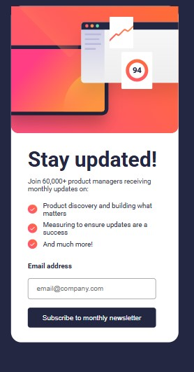

# Newsletter Sign-up Form with Success Message

This is a solution to the [Frontend Mentor challenge](https://www.frontendmentor.io/challenges/newsletter-signup-form-with-success-message-5F6WvBJyM). The goal was to build a responsive newsletter sign-up form with email validation and a success message screen.

## 🚀 Live Demo

👉 [Check it live here](https://hamzatchiche.github.io/signup-success-msg/)

## 📁 Features

- Email validation with custom error handling
- Responsive design (mobile & desktop)
- Confirmation screen after a successful submission
- Animations using GSAP
- Styled using custom CSS (no frameworks)

## 📸 Screenshots

### Desktop Preview



### Mobile Preview



> _(Add screenshots in a folder named `screenshots/` or change the image paths accordingly)_

## 🔧 Built With

- HTML5
- CSS3
- JavaScript (Vanilla)
- [GSAP](https://greensock.com/gsap/) for animations

## 🧪 How to Use

1. Clone the repository:
   ```bash
   git clone https://github.com/hamzatchiche/newsletter-signup-form.git
   cd newsletter-signup-form

 Author
GitHub: hamzatchiche

Frontend Mentor: @hamzatchiche
